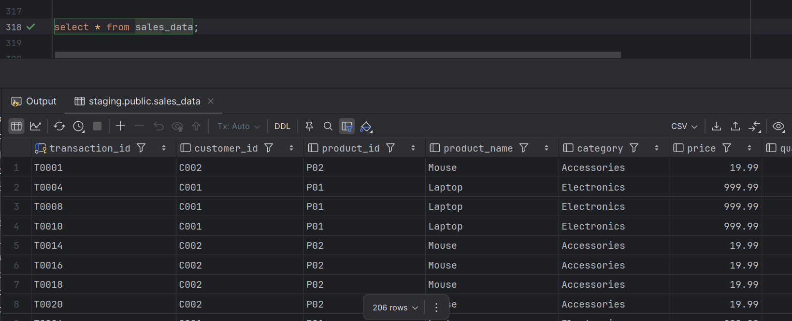

# Sales Data ETL Pipeline (PostgreSQL)

## Overview
This project implements a Python-based ETL pipeline to process semi-structured JSON sales data and load it into a PostgreSQL database.

## ETL Approach

### Extract
- Reads data from a JSON file using Python
- Handles nested structures

### Transform
- Flattens JSON using Pandas (`json_normalize`)
- Cleans data:
  - Missing `customer_id` → "UNKNOWN"
  - Missing `discount` → 0
- Removes invalid records (quantity ≤ 0, invalid dates)
- Standardizes date formats
- Creates a derived column:
  - `total_amount = price × quantity × (1 - discount)`

### Load
- Loads data into an existing PostgreSQL table (`sales_data`)
- Uses SQLAlchemy for database connection

## Incremental Load Logic
- Fetches existing `transaction_id` from the database
- Filters out already loaded records
- Inserts only new records to avoid duplicates

## How to Run
1. Install dependencies:
2. Configure database in `config.json`
3. Run: sales_data_pipeline.py

## Logging
- Logs stored in `etl_log.log`
- Tracks execution, inserted records, and errors

## Screenshots

## Conclusion
This pipeline efficiently processes JSON data, cleans it, and loads it incrementally into PostgreSQL, ensuring no duplicate records and reliable execution.